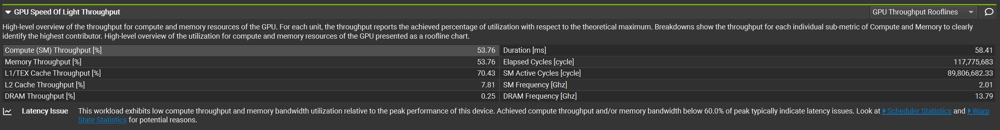
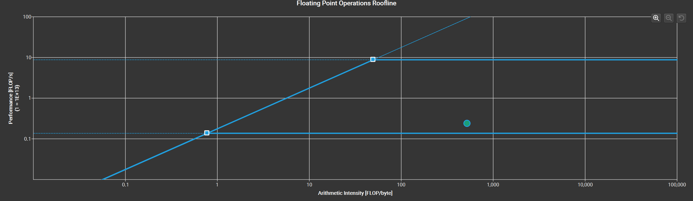
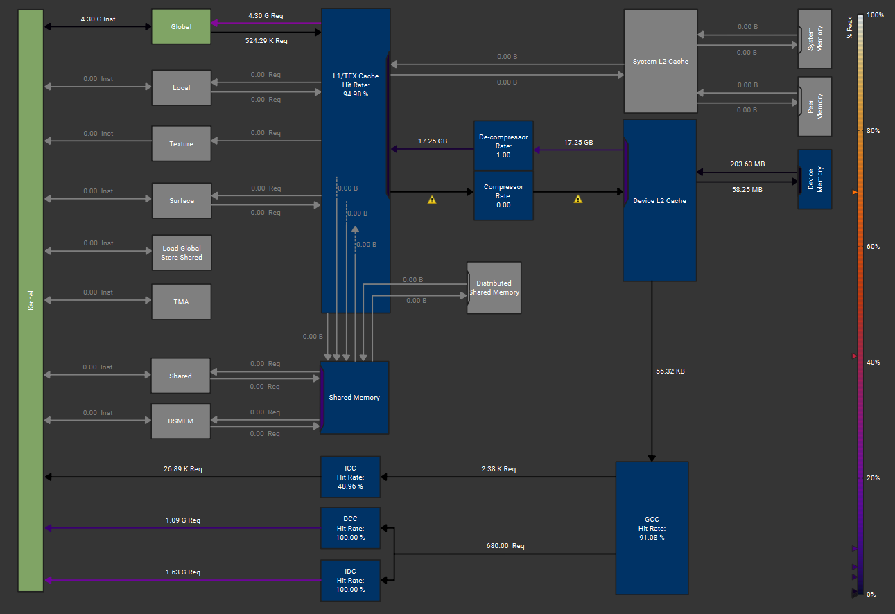
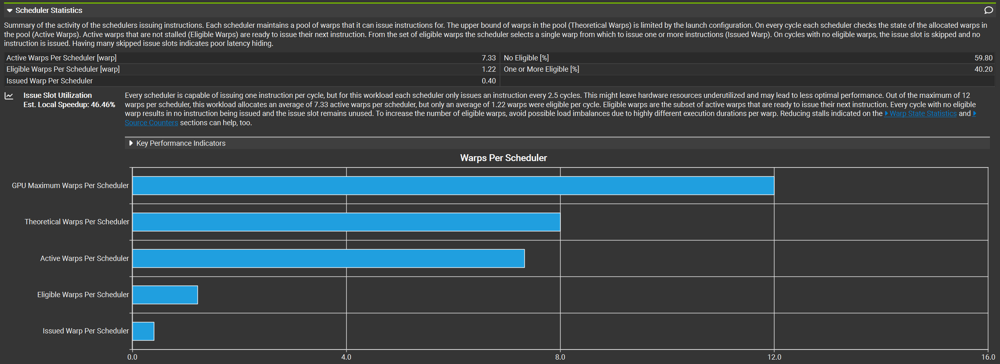
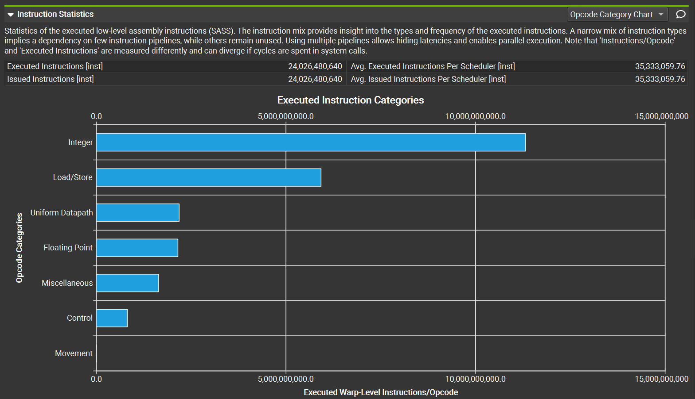

# sgemm优化笔记
## 确定最快运行时间的下限
对于$(M,K)$与$(K,N)$的矩阵乘法，然后加上一个$(M,N)$的矩阵：
1. 总共 $(K+K-1)*(MN)+(MN)$ FlOPs，如今MNK均为4096，则计算吞吐量为$137.439GFlOPs$.
2. 总共需要读取的数据总量：$3*4096^2*4B = 192MiB$。
3. 总共要存储的数据:$4096^2*4B=64MiB$

所以全局显存和计算核心之间必须传输的最小数据总量为$256MiB$，对于`5090`来说,标称FP32计算吞吐量为$104.8TFLOPS$，全局内存带宽为$1792.13GB/s$

所以理想情况下，计算需要$1.311ms$，内存传输需要$0.15ms$，所以只要数据传输总量至少不超过$2237.44MiB$的话，内核就还是计算受限型

那么以`gridDim<<<CEIL(M,32),CEIL(N,32)>>>`,`blockDim<<<32,32>>>`启动这个内核进行计算，并使用ncu进行profile，结果如下：
1. 计算层面上，内核计算时间为`58.41ms`,与理想情况下的`1.311ms`相差甚远，观察`roofline`图，尽管算术强度较高，但是距离理想峰值计算运算量还很远，说明并没有在高效地执行FP32运算
2. `SM Throughput`只有$53%$，更详细的可以查看`SM Sampling`,其算数逻辑单元和乘加逻辑单元都只有前半段处于一个“显忙”的状态，利用率也不高

3. `Memory Throughput`内存吞吐量只有$4.48Gbyte/s$，相比吞吐量理想情况差了400倍，`Mem Busy`只有`27.33%`,而`Mem Pipes Busy`有`53.76%`，内存指令吞吐量大于内存硬件利用率，说明内核在频繁的从L1、L2中取出数据，且每次只取一小点,从memory_chart进行分析，kernel向`global memory`请求次数达到了`4.3G`次,有些在`L1 Cache`中无法找到的，则转向更加缓慢的`L2 Cache`中，所做的这一切仅仅只是为了取`203.63MB`的数据

4. `scheduler_statistics`中的数据表示：理论上GPU中每个调度器能够调度12个线程束，而我的kernel内核理论上每个调度器能调度8个线程束，实际上工作的线程束有7.32个，而其中只有1.21个线程束是准备就绪的，而最终，平均每个周期调度器实际发射0.4条指令

5. `Warp_state_statistic`中分析可以看出`Stall LG Throttle`以及`Stall MIO Throttle`分别为`Local/Global memory`的以及`Memory input output`指令上的瓶颈，这两个指标阻塞高是因为对Global Memory的访存请求次数太多了，而`Stall Wait`是等待指令完成，`stall long/short Scoreboard`则是长（global memory 延迟）短（shared memory load、寄存器依赖）延迟操作，`Stall Not Selected`则是同一周期内，调度器选中了其他Warp执行而阻塞

6. 对于指令统计，最多指令指向整数计算，这在内核中为地址的计算，第二多的则是发出读写指令，第三多的则是`统一数据通路`，这通常处理哪些在整个Warp中都相同的计算，例如循环计数器或者Kernel参数的计算，第四个才是浮点指令

因此，根据以上分析，我们可以从减少全局内存访问次数，可以使用全局内存的合并访存